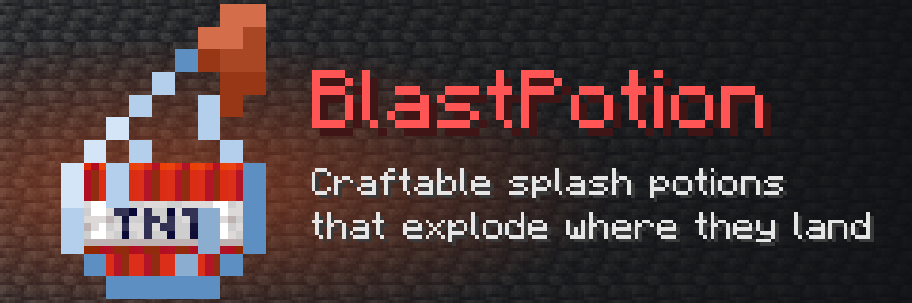

<div align="center">



Throw it and it explodes. Give each potion its own name, lore, explosion power and crafting recipe, or sell it in a
shop.

[](https://modrinth.com/plugin/blastpotion)
[](https://hangar.papermc.io/andret2344/BlastPotion)
[](https://github.com/andret2344/blast-potion/releases/latest)
[](https://modrinth.com/plugin/blastpotion/versions)

[](https://github.com/andret2344/blast-potion/actions/workflows/build.yml)
[](https://codecov.io/gh/andret2344/blast-potion)
[](https://papermc.io/software/paper)
[](https://adoptium.net/)
[](LICENSE)

[Download on Modrinth](https://modrinth.com/plugin/blastpotion) ·
[Download on Hangar](https://hangar.papermc.io/andret2344/BlastPotion) ·
[Report a bug](https://github.com/andret2344/blast-potion/issues)

</div>

## Features

- **Any potion you want** - pick the name, the lore and the explosion power of each potion in `config.yml`.
- **Crafted or sold** - give each potion its own crafting recipe, or leave it out and sell potions in a shop with
  `/bpot give`, which works from the console.
- **Fair explosions** - the explosion counts as the thrower's, and region protection plugins are respected.
- **Friendly to admins** - [MiniMessage](https://docs.papermc.io/adventure/minimessage/format/) names and lore,
  `/bpot reload` without a restart, and config errors that say exactly what is wrong and where.

## Installation

1. Download the jar from [Modrinth](https://modrinth.com/plugin/blastpotion),
   [Hangar](https://hangar.papermc.io/andret2344/BlastPotion) or
   [GitHub](https://github.com/andret2344/blast-potion/releases/latest).
2. Put it into the `plugins` folder of a Paper (or Purpur) 26.2+ server running Java 25.
3. Start the server and edit `plugins/BlastPotion/config.yml`, then run `/bpot reload`.

## Commands and permissions

| Command                                 | Permission           | Description                                        |
|-----------------------------------------|----------------------|----------------------------------------------------|
| `/bpot get <potion> [amount]`           | `blastpotion.get`    | Puts a blast potion into the inventory             |
| `/bpot give <player> <potion> [amount]` | `blastpotion.give`   | Puts a blast potion into the inventory of a player |
| `/bpot reload`                          | `blastpotion.reload` | Loads the config again                             |

`/bpot` is an alias of `/blastpotion`. All permissions are given to operators by default and are part of
`blastpotion.*`.

### Selling potions in a shop

`/blastpotion give` works from the console, so any shop plugin that runs commands can sell potions:

```
blastpotion give {player} throwable-tnt 5
```

Use the full name, not the `bpot` alias: the alias goes to only one plugin when another one has it too, and then the
player pays without getting the potion.

The amount is optional, 1 by default and at most 36 (a full inventory). Potions that do not fit into the inventory are
dropped at the player's feet.

## Configuration

```yaml
potions:
  throwable-tnt:             # unique name, also the recipe name
    explosion-power: 3.25    # required, any positive number, 4 is TNT
    item:                    # optional
      name: '<dark_purple>Throwable TNT'
      lore:
        - '<dark_green>Throw it'
        - '<dark_green>to explode!'
    crafting:                # optional, without it the potion can only be given with the command
      shape:
        - 'NGN'
        - ' T '
        - ' A '
      mapping:
        'N': NETHER_WART
        'G': GOLD_BLOCK
        'T': TNT
        'A': ARROW
```

`/bpot reload` keeps the current config when the new one is invalid and says what is wrong with it.

### How potions behave

- A blast potion explodes where it lands instead of splashing. The explosion breaks blocks and does not set fire.
- The explosion counts as caused by the player who threw the potion.
- A potion thrown where a protection plugin does not allow it does not explode.
- A potion removed from the config turns into a regular splash potion without effects.
- The names of the potions in `config.yml` identify the potions players have. Renaming a potion turns the existing ones
  into regular splash potions, so pick the names once.

## Building from source

```sh
./gradlew build
```

The plugin jar is `build/libs/BlastPotion-<version>.jar`. The build runs the test suite (JUnit and MockBukkit) and
requires at least 80% test coverage.

## Metrics

BlastPotion sends anonymous usage statistics to [bStats](https://bstats.org/plugin/bukkit/atsExplosivePotion/10681).
They can be turned off for all plugins in `plugins/bStats/config.yml`.

## License

Licensed under the [Apache License 2.0](LICENSE). If you redistribute this plugin or anything built from it, you have
to keep the contents of the [NOTICE](NOTICE) file, which links back to this repository.
